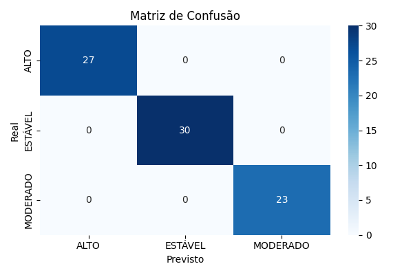

# Previsão de Risco de Deslizamento com Machine Learning e Sensores

## Integrantes: 
- Carlos Daniel Silveira Do Nascimento - RM88439
- Mauricio Jose Ferlin Tonnera - RM565469
- Rodrigo Portugal Santos - RM564773

## O Projeto
Este projeto simula um sistema de previsão de risco de deslizamentos utilizando:
- Sensor de umidade (via potenciômetro) em um ESP32, simulado no Wokwi
- Entrada dos dados no Python de forma manual, representando a leitura via Serial
- Machine Learning (Random Forest)
- Análise exploratória com R
- Dados simulados baseados em eventos reais documentados

> Observação técnica: A entrada dos dados no Python ocorre manualmente nesta versão, representando valores que poderão futuramente ser enviados via Serial em uma integração completa com os sensores.

## Estrutura do Repositório

```
/
├── circuito/                    # Simulação do circuito no Wokwi
│   ├── diagram.json            # Circuito completo com conexões
│   ├── sketch.ino              # Código que envia os dados via Serial
│   └── wokwi-project.txt       # Link direto para abrir o projeto

├── dataset/                     # Base de dados simulada
│   └── Dataset_Modelo.csv      # Dados com risco ALTO, MODERADO, ESTÁVEL

├── graficos/                    # Análise e visualização de dados
│   ├── analise_graficos.R      # Script que gera os gráficos com ggplot2
│   └── img/
│       ├── barplot_risco.png
│       ├── boxplot_chuva.png
│       ├── boxplot_inclinacao.png
│       ├── boxplot_umidade.png
│       ├── densidade_chuva.png
│       └── dispersao_inclinacao_chuva.png

├── ml/                          # Scripts e artefatos de Machine Learning
│   ├── treino_modelo.py        # Treina modelo RandomForest balanceado
│   ├── previsao_manual.py      # Faz previsão a partir de entrada manual
│   ├── modelo_risco.pkl        # Modelo salvo
│   ├── label_encoder_risco.pkl # Codificador da variável risco
│   ├── matriz_confusao.png     # Avaliação do modelo
│   └── log_treinamento.txt     # Log de acurácia e métodos usados

└── README.md                    # Este arquivo
```

## Objetivo
Criar um sistema funcional e interpretável capaz de prever, com base em variáveis ambientais:
- Se o solo está **estável**, **moderadamente instável** ou com **alto risco de deslizamento**.

## Machine Learning

O modelo foi treinado com dados simulados coerentes com condições reais:
- **RandomForestClassifier** com `class_weight='balanced'`
- Entrada: umidade, aceleração, inclinação, chuva acumulada
- Acurácia: **100% no conjunto de teste**



## Análise com R

Os seguintes gráficos foram gerados para avaliar a influência das variáveis no risco:

- Distribuição de umidade, inclinação e chuva por classe de risco
- Frequência de classes
- Dispersão entre variáveis
- Densidade de chuva por risco

Todos estão na pasta [`graficos/img/`](graficos/img).

## Simulação no Wokwi

O sensor foi simulado usando um potenciômetro conectado ao pino analógico A2 (GPIO34).

[Abrir simulação no Wokwi](https://wokwi.com/projects/432972150269769729)

Para recriar o circuito:
1. Acesse Wokwi
2. Clique em "Import Project"
3. Selecione `diagram.json` da pasta `circuito/`

## Como executar localmente

### Python (ML e previsão):
```bash
cd ml
python treino_modelo.py   # Treina o modelo
python previsao_manual.py # Testa entrada manual
```

### R (Gráficos):
Abra o arquivo `graficos/analise_graficos.R` no RStudio ou Posit Cloud.
